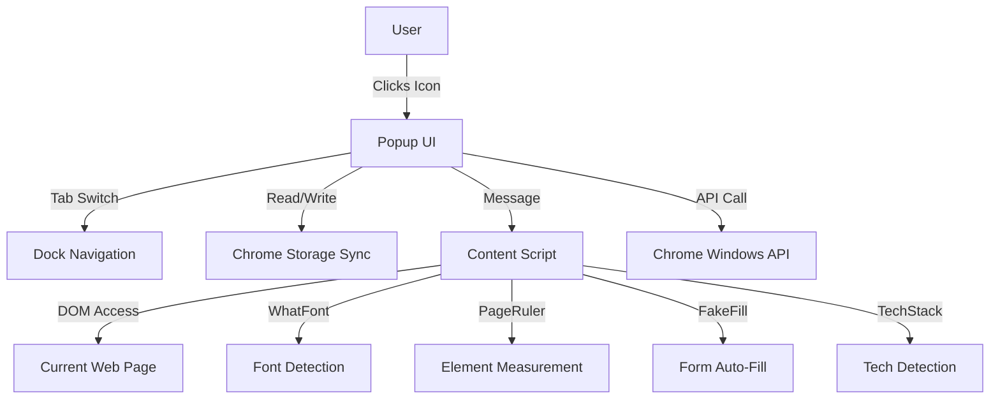

# Architecture

## Project Name
DevPower Toolkit

## System Context
The **DevPower Toolkit** is a Chrome Extension built on **Manifest V3**. It provides a comprehensive suite of developer utilities directly in the browser popup and interacts with web pages via content scripts.

### High-Level Diagram


## Directory Structure
```
hello_extension/
├── manifest.json       # Extension configuration (MV3)
├── popup.html          # Main UI entry point
├── popup.js            # Popup logic & feature handlers
├── style.css           # Macism design system
├── content.js          # Page injection script
├── icon.png            # Extension icon
├── start_dev.sh        # Development helper script
└── rag/                # Documentation
    ├── architecture.md
    ├── business_logic.md
    ├── workflows.md
    ├── rules.md
    ├── tech_stack.md
    └── templates/
```

## Key Components

### 1. Popup (popup.html + popup.js + style.css)
- **Purpose**: Main UI container with 4 tabs
- **Tabs**: Settings | Tools | Develop | Tasks
- **Design**: Macism (macOS-inspired) with glassmorphism

### 2. Content Script (content.js)
- **Purpose**: Page interaction for advanced features
- **Features**:
  - Tech Stack Detection
  - WhatFont (hover font detection)
  - Page Ruler (measurement overlay)
  - Fake Filler (form auto-fill)

### 3. Manifest (manifest.json)
- **Version**: 3 (MV3)
- **Permissions**: `activeTab`, `scripting`, `contentSettings`, `browsingData`, `storage`, `tabs`, `windows`, `clipboardWrite`
- **Host Permissions**: `<all_urls>`

## Key Data Flows

### 1. Tech Stack Detection
```
Popup → sendMessage("scanTech") → Content Script → detectTechStack() → Response → Display badges
```

### 2. WhatFont
```
Popup → sendMessage("whatFont") → Content Script → Activate hover mode → User hovers → Show tooltip → Click to copy
```

### 3. Page Ruler
```
Popup → sendMessage("pageRuler") → Content Script → Create overlay → User drag → Show dimensions → Copy to clipboard
```

### 4. Fake Filler
```
Popup → sendMessage("fakeFill") → Content Script → fillForms() → Response with count → Update button
```

### 5. Window Resizer
```
Popup → chrome.windows.getCurrent() → chrome.windows.update(width, height)
```

### 6. Todo List
```
Load → chrome.storage.sync.get() → Render items
Add → saveTodo() → chrome.storage.sync.set()
Toggle/Delete → updateTodo()/deleteTodo() → chrome.storage.sync.set()
```

### 7. Color Picker
```
User click → EyeDropper.open() → Get sRGBHex → Display & Copy to clipboard
```

### 8. Base64/URL Tools
```
Input → btoa()/atob() or URL parsing → Output → Copy to clipboard
```
