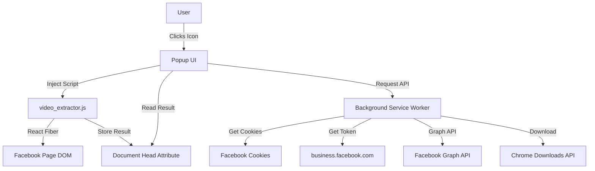

# Architecture

## Project Name
FB Video Downloader

## System Context
The **FB Video Downloader** is a Chrome Extension built on **Manifest V3** that enables users to download videos and Reels from Facebook. It uses a combination of React Fiber inspection and Facebook Graph API to extract video URLs.

### High-Level Diagram


## Directory Structure
```
fb_video_downloader/
├── manifest.json       # Extension configuration (MV3)
├── popup.html          # Main UI entry point
├── popup.js            # Popup logic
├── style.css           # Macism design system
├── background.js       # Service worker (Graph API, downloads)
├── content.js          # Page content script
├── video_extractor.js  # Injected script (React Fiber)
├── injected.js         # Alternative injector
├── icon*.png           # Extension icons
└── rag/                # Documentation
```

## Key Components

### 1. Popup (popup.html + popup.js + style.css)
- **Purpose**: Simple one-click download interface
- **Design**: Macism (macOS-inspired) with glassmorphism
- **Flow**: Detect page → Extract video → Download

### 2. Background Service Worker (background.js)
- **Purpose**: Handle Facebook API calls and downloads
- **Features**:
  - Cookie extraction (c_user, xs)
  - Access token retrieval from business.facebook.com
  - Facebook Graph API video source lookup
  - Chrome Downloads API integration

### 3. Video Extractor (video_extractor.js)
- **Purpose**: Inject into Facebook page to extract video URLs
- **Method**: React Fiber inspection
- **Runs in**: MAIN world (page context)

### 4. Content Script (content.js)
- **Purpose**: Bridge between popup and page
- **Features**:
  - Reel ID extraction from URL
  - Pattern matching in page HTML
  - Message relay to background

## Key Data Flows

### 1. Direct URL Extraction (React Fiber)
```
Popup → scripting.executeScript(video_extractor.js, MAIN)
     → Find __reactFiber props → hdSrc/sdSrc
     → Store in document.head attribute
     → Popup reads attribute → Download
```

### 2. Graph API Fallback
```
Popup → Extract videoId from page
     → sendMessage("getVideoByGraphApi")
     → Background gets cookies + access token
     → graph.facebook.com/v13.0/{videoId}?fields=source
     → Return source URL → Download
```
